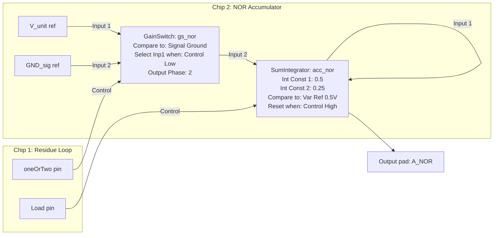

# kbee-04 — full 8-digit kbee with NOR/XOR/AND analog accumulators

**Design file:** `fpaa/designs/kbee-04.ad2` (canonical four-chip export; the
first-silicon milestone per the plan).
**AD2 HTML report:** `fpaa/designs/reports/kbee-04/kbee-04.htm` with
companion `*.png` in the same directory (AD2 export of schematics, clocks, and
CAM / I/O settings). Re-export when topology or parameters change so the
report matches the working `.ad2`.
**Target chip:** AN231E04.
**Depends on:** kbee-03 (residue loop) + the gating mechanism selected in
kbee-02, and the AD2 patterns locked in by kbee-00's sim (see addendum below).
Uses `data/kbee-w8-refs.csv` for ground truth.

> *"plan §N" citations refer to the project's internal design plan, which is not included in this public repo.*

> **2026-04-22 AD2 LESSONS (from kbee-00 sim).** Three analog output
> pins (`A_NOR`, `A_XOR`, `A_AND`) drive downstream kbee chips, so each
> needs the **Hold-before-Bypass** chain. Good news: the time-shared
> accumulator core already terminates each branch in a `Hold` (or
> `GainHold`) CAM that feeds the branch's storage register, and that
> Hold output is continuous-time — it can drive the IOCell directly
> without an extra Hold stage. Confirm this during build by probing
> each `A_b` pin and checking it does **not** show a phase-modulated
> square wave. If it does (e.g. because the chosen accumulator
> topology ends in a half-cycle SumDiff feeding the pin tap), insert
> one additional `Hold` per analog output pin and revisit the CAB
> budget. Siggens on `x` and `y` go in **Differential** mode (`Diff Offset = V_input`, `CM = 1.5 V`, Amp = 0). Point SC CAMs at **Clock
> 3** (250 kHz default) and **Clock 2** (750 kHz for the accumulator
> sub-tick rate, per plan §6). See [`docs/ad2-conventions.md`](../../docs/ad2-conventions.md)
> for AD2 patterns and [`kbee-04-hw-bringup-checklist.md`](kbee-04-hw-bringup-checklist.md)
> for probe maps.

> **2026-04-27 UPDATE.** The three parallel accumulators (`A_NOR`, `A_XOR`,
> `A_AND`) do not fit in the 4 CABs of a single AN231E04 chip.
> `A_NOR` takes 3 CAMs (SumDiff, GainSwitch, SumIntegrator).
> `A_XOR` takes **2** CAMs (GainSwitch with **Dual Input** comparator,
> SumIntegrator) — see *Chip 3 — XOR Dual-input GainSwitch* below.
> `A_AND` takes 2 CAMs (GainSwitch, SumIntegrator).
> Total: **7** CAMs across the three accumulator chips. Routing constraints
> and I/O cell limits (only 7 cells available) prevent a single-chip
> implementation.
>
> The `kbee-04` architecture is now officially a **four-chip kbee**:
>
> - **Chip 1 (AN231E04)**: Runs the 8-tick residue loop (`kbee-03` design).
>   Outputs the classifier handoff and tick clock. Legacy bring-up used
>   digital bits (`oneOrTwo`, `isTwo`); the 2026-05 redesign lock uses
>   signed analog `S` as the primary handoff signal (see section below).
>   In the canonical tidy export, classifier rail holding is implemented
>   in the OUTPUT IO cells (Output Sample-and-Hold), so separate output
>   Hold CAMs for `oneOrTwo/isTwo` are not required.
> - **Chip 2 (AN231E04)**: Runs the `A_NOR` accumulator (3 CAMs, 2 CABs).
> - **Chip 3 (AN231E04)**: Runs the `A_XOR` accumulator (**2** CAMs, same idea as `A_AND`).
> - **Chip 4 (AN231E04)**: Runs the `A_AND` accumulator (2 CAMs, 1 CAB).
>
> This document describes the design for the three accumulator chips.

## Goal

Complete the kbee black box: take two binary-constrained ternary inputs and
produce three analog voltages encoding NOR, XOR, AND at `V_range = 1.000 V`
scale, ready to feed back as inputs to a downstream kbee. This is the stage
that closes both the `z` residue loop **and** the three analog accumulator
loops for 8 ticks.

## 2026-05 redesign lock — signed `S` handoff

The `kbee-03-redesign` branch locked the residue rails at `V_range = 1.2 V`
with classifier regimes:

- `digit 0`: `[0.0, 0.4)`
- `digit 1`: `[0.4, 0.8)`
- `digit 2`: `[0.8, 1.2)`

Classifier handoff from Chip 1 to accumulator chips is now the signed analog
signal:

`S = (V_range - gs_oneOrTwo.Out - gs_isTwo.Out) / 3`

Nominal levels are:

- `digit 0` -> `S = +0.4 V`
- `digit 1` -> `S = 0 V`
- `digit 2` -> `S = -0.4 V`

Because `S` is produced through a full-cycle `SumFilter` with finite corner
frequency (25 kHz at Clock 3 = 250 kHz), accumulator gating uses guardbands
rather than exact-level decode:

- `NOR` when `S > +0.15 V`
- `XOR` when `-0.15 V <= S <= +0.15 V`
- `AND` when `S < -0.15 V`

Boundary calibration for strict interval behavior is locked in the
*2026-05 redesign lock* section above; use those calibrated thresholds as the
source of truth.

## Algorithm recap (from plan §1)

```
# Per tick k = 0..7 (MSB first):
if z_k < V_range/3:        d_k = 0;  z_{k+1} = 3·z_k
elif z_k < 2·V_range/3:    d_k = 1;  z_{k+1} = 3·(z_k − V_range/3) = 3·z_k − V_range
else:                      d_k = 2;  z_{k+1} = 3·(z_k − 2·V_range/3) = 3·z_k − 2·V_range

A_NOR_{k+1} = 3·A_NOR_k + V_unit·[d_k == 0]
A_XOR_{k+1} = 3·A_XOR_k + V_unit·[d_k == 1]
A_AND_{k+1} = 3·A_AND_k + V_unit·[d_k == 2]
```

Starting with `A_* = 0` at tick 0 and `V_unit = V_range/6561 ≈ 0.1525 mV`,
after tick 7:

```
A_NOR = Σ_{k=0..7} V_unit · [d_k==0] · 3^{7−k}   # same positional weight as z
```

and likewise for XOR and AND — each `A_*` is the voltage encoding of the
8-digit base-3 output number with digits in `{0, 1}`.

**Key observation:** on every tick, *all three* accumulators multiply by 3
(because the recurrence adds zero to the two non-matching branches). So we
can't skip any accumulator's shift update — exactly one of the three also
adds `V_unit` on top.

## Architecture — 4-chip distributed accumulators

The original plan (a time-shared accumulator core on a single chip) was abandoned due to CAB routing constraints and I/O cell limits. The `kbee-04` architecture is now officially a **four-chip kbee**:

- **Chip 1 (AN231E04)**: Runs the 8-tick residue loop (`kbee-03` design). Primary handoff is signed analog `S`; digital bits (`oneOrTwo`, `isTwo`) remain valid debug/export rails.
- **Chip 2 (AN231E04)**: Runs the `A_NOR` accumulator.
- **Chip 3 (AN231E04)**: Runs the `A_XOR` accumulator.
- **Chip 4 (AN231E04)**: Runs the `A_AND` accumulator.

### The 2-CAM Accumulator Trick

Each accumulator chip uses an incredibly efficient 2-CAM design to implement the discrete shift-and-add equation $A\_{k+1} = 3 \\cdot A_k + V\_{unit} \\cdot \\text{isBranch}$:

1. **`GainSwitch` (The Gating Mechanism):** Acts as an analog MUX. It takes `V_unit` and `GND_sig` as inputs, and uses the digital classifier bit from Chip 1 to select between them. For example, the NOR chip selects `V_unit` when `oneOrTwo` is LOW.
1. **`SumIntegrator` (The Math & Storage):** Computes the sum and handles the $3\\times$ multiplier. By routing its output back into its own Input 1 with an Integration Constant of `0.5` (which realizes a gain of $2.0$ over a 4µs tick), and relying on the integrator's inherent $+1.0$ retention of its previous value, it achieves exactly a $3.0\\times$ feedback multiplier. Input 2 takes the gated `V_unit` from the GainSwitch.

**Crucial Phase Alignment:** The `GainSwitch` must be set to **Output Phase 2**. The `SumIntegrator` has non-inverting inputs, which means it samples on **Phase 2**. Aligning these phases ensures the integrator reads the valid gated voltage.

**The Reset Pulse:** Because the `SumIntegrator` is continuous-time, it will run away if left unchecked. The `Load` pulse from Chip 1 is routed to the `SumIntegrator`'s reset comparator (running on Clock B at 500 kHz). The `Load` pulse must be asserted HIGH exactly after the 8th tick (at $t=50\\text{ \\mu s}$) to capture the final value and reset the accumulator to 0V for the next cycle.

## Residue-style NOR accumulator variant (no SumIntegrator)

If the 4 us-vs-12 us interaction around the integrator reset window is unstable
in your bench wiring, you can implement `A_NOR` using the same recurrence-loop
idiom as `kbee-03` residue.

Target recurrence:

`A_NOR[k+1] = 3 * A_NOR[k] + V_unit * [digit_k == 0]`

where `[digit_k == 0]` is a 0/1 selector from the classifier rails.

### CAM topology (Chip 2, NOR only)

- `gs_nor` (`GainSwitch`): branch gate.
  - Input 1 = `V_unit`
  - Input 2 = `GND_sig`
  - Control = classifier NOR-select rail (for classic rails, this is
    `oneOrTwo` with "Select Input 1 when Control Low")
  - Output = `inj_nor[k]` in `{0, V_unit}`
- `acc_nor_sd` (`SumDiff`, 4-input): recurrence math.
  - Input 1 (non-inverting) = delayed accumulator state, gain `+3.0`
  - Input 2 (non-inverting) = `inj_nor`, gain `+1.0`
  - Inputs 3/4 unused
  - Output = `A_tmp[k+1]`
- `a_hold` (`Hold`): accumulator state register and continuous output driver.
  - Input = `acc_nor_sd.Out`
  - Output = `A_NOR` state rail and output-pin source
- `a_delay` (`Hold`): feedback symmetriser (recommended).
  - Input = `a_hold.Out`
  - Output = `acc_nor_sd.Input 1`
  - Purpose: match the known one-clock `GainSwitch` analog-output delay by
    delaying the `3*A` path one clock as well.

### Clock / phase settings

- Run all CAMs on `Clock 3` (250 kHz default, 4 us period).
- `gs_nor` comparator sampling phase: `Phase 2` (match current NOR branch
  settings unless sim proves otherwise).
- `a_hold` input sampling phase: `Phase 1`.
- `a_delay` input sampling phase: `Phase 2` (opposite of `a_hold`; same
  two-Holds phase rule used in `kbee-03`).
- `acc_nor_sd` output phase: `Phase 1`.

This gives one accumulator update per residue tick (4 us), with no separate
integrator sub-cycle.

### Wiring checklist

1. Remove `acc_nor` (`SumIntegrator`) from the NOR chip.
1. Keep `gs_nor` as the NOR branch gate (`V_unit` vs `GND_sig`).
1. Add `acc_nor_sd` (`SumDiff`) and wire:
   - `a_delay.Out -> acc_nor_sd.Input 1` (gain `+3`)
   - `gs_nor.Out -> acc_nor_sd.Input 2` (gain `+1`)
1. Add `a_hold` and wire:
   - `acc_nor_sd.Out -> a_hold.In`
   - `a_hold.Out -> A_NOR output IOCell`
1. Add `a_delay` and wire:
   - `a_hold.Out -> a_delay.In`
   - `a_delay.Out -> acc_nor_sd.Input 1`
1. Keep your existing run/reset sequencing source. If your bench currently uses
   inverted `Load` polarity on accumulator chips, preserve that polarity while
   validating this variant.

### Expected behavior and quick validation

- First non-seed update appears after pipeline priming latency (from the Hold
  chain), then updates every 4 us.
- No continuous-time integrator runaway path exists; state is explicit in
  `a_hold`.
- In per-tick decode, `A_NOR` should follow the oracle recurrence above with
  the same gate-delay compensation rationale as the residue loop.

Recommended first pass:

- Compare per-tick `A_NOR` against the oracle recurrence above using rows from
  `data/kbee-w8-refs.csv`.
- Then validate NOR captures with the active bench checkers before touching the
  other branches (see [`kbee-04-hw-bringup-checklist.md`](kbee-04-hw-bringup-checklist.md)).

### On-chip OR from NOR (NOT on binary-format base-3 code)

If Chip 2 still has CAM/pin budget, add an OR output by complementing NOR at
fixed width:

`A_OR = NOT(A_NOR) = R_W - A_NOR`, where `R_W = (3^W - 1)/2` (all-ones code).

For `W=4`, `R_W = 40` codes. With `V_range=1.2 V`, `V_unit=1.2/81`, so:

`V_all_ones = 40 * V_unit = 0.592593 V`.

#### CAM topology (OR add-on on Chip 2)

- `or_from_nor` (`SumDiff`, 4-input):
  - Input 1: non-inverting, gain `+1.0`, driven by `V_all_ones` reference
  - Input 2: inverting, gain `1.0`, driven by `a_hold.Out` (`A_NOR`)
  - Output: `A_OR_raw = V_all_ones - A_NOR`
- `or_hold` (`Hold`, recommended):
  - Input = `or_from_nor.Out`
  - Output = continuous `A_OR` rail for output pin / probing

#### Wiring / settings

1. Provide `V_all_ones` as a constant analog reference on a spare input pin
   (or equivalent local reference source).
1. Wire `V_all_ones -> or_from_nor.Input 1`.
1. Wire `a_hold.Out -> or_from_nor.Input 2` (inverting path).
1. Wire `or_from_nor.Out -> or_hold.In`.
1. Route `or_hold.Out` to a spare output IO cell as `A_OR`.
1. Keep `or_from_nor` on `Clock 3`; set `or_hold` sampling phase to match
   `or_from_nor` output phase.

`A_OR` needs no independent reset path: it tracks `A_NOR` combinationally each
tick and is therefore reset when `A_NOR` resets.

## Block diagram (Chip 2: NOR Accumulator)



## Clock plan

- Master clock: **Clock 3 = 250 kHz** (the AN231E04 default, `Sys1 / 64`).
- Tick period: one SC period per tick (4 µs).
- Total kbee op time: 8 ticks × 4 µs = 32 µs.

Since `kbee-04` is now Chips 2–4, each accumulator chip receives `S` and
`Load` from Chip 1; `oneOrTwo`/`isTwo` are optional debug rails.
This architecture no longer needs sub-tick time sharing.

## CAB budget (Chips 2, 3, & 4)

With 4 CABs available per chip, we build each accumulator on its own chip
to avoid I/O cell starvation and routing congestion.

**Chip 2 (A_NOR)**
| CAB | Contents |
|-----|-----------------------------------------------------------------------|
| 1 | `A_NOR` branch: `nor_gate` (SumDiff) + `gs_nor` (GainSwitch) |
| 2 | `A_NOR` branch: `acc_nor` (SumIntegrator) |

**Chip 3 (A_XOR)**
| CAB | Contents |
|-----|-----------------------------------------------------------------------|
| 1 | `A_XOR` branch: `gs_xor` (GainSwitch, **Dual Input**) |
| 2 | `A_XOR` branch: `acc_xor` (SumIntegrator) |

Per GainSwitch help (*Compare Control To: Dual Input*), mux **Input 1** is
selected when **Control is higher than Reference**. In AD2: set **Compare
Control To** → **Dual Input**; wire **Control** ← `oneOrTwo`, **Reference** ←
`isTwo` (same pins already routed from `FPAA1`); **Select Input 1 When** →
**Control High**; **Gain** inputs **1 / 2** ← `V_unit` / `GND_sig` as on NOR
and AND. Then `[d_k = 1]` ⇔ `(oneOrTwo,isTwo) = (HIGH, LOW)` ⇒ inject;
`(LOW,LOW)` and `(HIGH,HIGH)` ⇒ no inject — **no** `xor_gate` SumDiff. Prefer
**Comparator Sampling Phase** = **Phase 2** to match `gs_nor` / `gs_and` unless
sim says otherwise.

If digit **2** false-fires because both rails read equal within the comparator
offset, trim realised HIGH levels on the two classifier outputs (same playbook
as [`kbee-05-precision-backoff.md`](kbee-05-precision-backoff.md)).

**Chip 4 (A_AND)**
| CAB | Contents |
|-----|-----------------------------------------------------------------------|
| 1 | `A_AND` branch: `gs_and` (GainSwitch) + `acc_and` (SumIntegrator) |

This is a clean, parallel architecture. Each branch computes:
`A_{k+1} = 3·A_k + V_unit·isBranch`

## Build steps (in AD2)

Open `fpaa/designs/kbee-04.ad2` in AD2. The canonical export already contains
the four-chip topology (residue on Chip 1, `A_NOR` / `A_XOR` / `A_AND` on
Chips 2–4). Re-export `fpaa/designs/reports/kbee-04/kbee-04.htm` when topology
or parameters change.

**Historical note:** earlier bring-up merged a kbee-03 residue design with
per-branch accumulator sub-designs inside AD2. That incremental workflow and
the intermediate `.ad2` files are not shipped in this repo; use the canonical
`kbee-04.ad2` export.

**XOR chip check:** on Chip 3, confirm **`gs_xor`** uses **Compare Control To:
Dual Input** — comparator **Control** ← **`oneOrTwo`**, **Reference** ←
**`isTwo`**; **Select Input 1 When** → **Control High**; **Comparator Sampling
Phase** → **Phase 2** (same as `gs_nor` / `gs_and` unless sim dictates
otherwise). There should be no standalone **`xor_gate`** SumDiff in the current
topology.

## Simulation and bench validation

Canonical validation uses the **pulse/zero flow** (`A=32 µs`, `B=8 µs`):

1. Generate waveforms: `python3 fpaa/scripts/gen-zsum-4trit-81-pulse-zero.py`
1. Run AD2 sim or bench captures per
   [`kbee-04-hw-bringup-checklist.md`](kbee-04-hw-bringup-checklist.md)
1. Validate with the active checkers in [`fpaa/scripts/README.md`](../scripts/README.md)
1. Compare final codes/voltages against `data/kbee-w8-refs.csv`

For extended sweeps, sample rows from `data/kbee-w8-refs.csv`, capture at the
agreed `VALID` instant, and log per-output error in mV to `fpaa/data/kbee-04-sim.csv`.

### Historical sim notes

Earlier bring-up used eight-pick classifier stimulus exports and offline decode
harnesses (removed from this repo). Findings retained for design context:

- **GainSwitch §8 delay:** accumulator outputs track `gate(d_{k−1})` unless
  rail timing is compensated (see [`docs/ad2-conventions.md`](../../docs/ad2-conventions.md)).
- **Plan-§1 invariant:** `nor_code + xor_code + and_code = 3280` per row when
  gate exclusivity holds, even if per-output voltages are off.
- **Global scale:** measured invariant sums were typically ~9 codes low (~0.27%
  effective gain error).
- **Residue transitions:** dynamic classifier rails and accumulator load polarity
  were validated on 5-segment `z_sum` schedules before the canonical A32/B8 flow.

## Bring-up validation (uniform digit class)

Bench designs may route **`oneOrTwo`**, **`isTwo`**, and **`Load`** through
**FPAA1** as passthrough (no residue CAMs on that chip) while developing **Chips
2–4**. Drive **`oneOrTwo`** and **`isTwo`** from **differential** siggens
(`Common Mode = 1.5 V`, **`Peak = 0`**, logical level on **Differential
Offset**). **`Load`**: pulse **HIGH** first (**~6 µs**) then **LOW** (**~40
µs**, **46 µs** period); **`acc_*`** integrates during **LOW** and resets when
**`Load`** is **HIGH**. Sample each **`A_*`** near the **end** of a **LOW**
phase (**decode `V_logical = Ch_pos − Ch_neg`** on the differential output pair).

**XOR branch:** **`gs_xor`** uses **Compare Control To: Dual Input** —
comparator **Control** ← **`oneOrTwo`**, **Reference** ← **`isTwo`**.

Validated in AD2 sim (2026): **steady** classifier rails produce **constant
digits** on every tick. Final **`nor_V` / `xor_V` / `and_V`** match
`data/kbee-w8-refs.csv` for those uniform-digit rows:

| Steady `(oneOrTwo, isTwo)` | Digit | Integrates |
|---------------------------|-------|------------|
| LOW, LOW | 0 | **`A_NOR`** |
| HIGH, LOW | 1 | **`A_XOR`** (`d1-mid`: **`xor_V ≈ 0.499924 V`**) |
| HIGH, HIGH | 2 | **`A_AND`** |

The other two branches stay near **0 V** logical.

**Limitation:** mixed-digit rows (e.g. eight canonical picks with **changing**
**`digit_k`**) need **`FPAA1`** residue **or** **time-scheduled**
**`oneOrTwo`/`isTwo`** — not reproducible with a **single** DC pair for the
whole **32 µs** op.

## Hardware test plan

Same shape as sim, but:

1. Route the three `A_*` output pads to oscilloscope channels.
1. Drive `x` and `y` from the dev-board's DAC / siggen through the
   input pins.
1. Step through a 256-row sample first (or 4096 if time allows) and
   then the full sweep.
1. Log bench results under `data/hw-runs/` (see
   [`kbee-04-hw-bringup-checklist.md`](kbee-04-hw-bringup-checklist.md)).

## Pass criteria

### Sim (AD2 ideal-analog)

- **Zero** mismatches on all three outputs for the eight-pick stimulus
  *and* the 100-vector sample *and* the 65536-vector sweep, at the
  `V_unit / 2 ≈ 0.076 mV` bit-decision boundary.
- **Plan-§1 invariant:** `A_NOR_code + A_XOR_code + A_AND_code = (3^W − 1) / 2 = 3280` per row (because each tick contributes exactly one unit to
  exactly one accumulator, weighted by 3^{7−k}). Check from scope captures
  when all three accumulator outputs are available; violations indicate a
  double-firing or stuck gate (gate exclusivity broken), separately from
  per-output voltage tolerance.

### Hardware (AN231E04 silicon)

- **≤ 5 % per-row error rate** at the bit-decision boundary for NOR,
  XOR, and AND outputs across the 65536-vector sweep.
- Per-digit error rate: report breakdown by output-digit position; the
  LSB of each output is expected to fail first (it sees the full 3^8 =
  6561× gain-compounded error — see plan §5).

If hardware misses the pass criteria, use the current timing/phase-alignment
playbook first; the old precision-backoff ladder is retained as historical
fallback only in [`kbee-05-precision-backoff.md`](kbee-05-precision-backoff.md).

Follow-up TODO (after residue/export timing is stable in sim): evaluate
`V_range = 1.2 V` as a separate calibration pass, update comparator
thresholds to `V_range/3` and `2*V_range/3`, and rerun decode with
`--v-range 1.2`.

## Handoff

kbee-04 is the first product. Three analog output voltages usable as
inputs to any other kbee instance. The NAND-composition todo
(step 8 of the plan) uses four kbee-04 instances in series; the
32-bit RISC-V sketch (step 9) uses four kbee-04 instances in
parallel.
