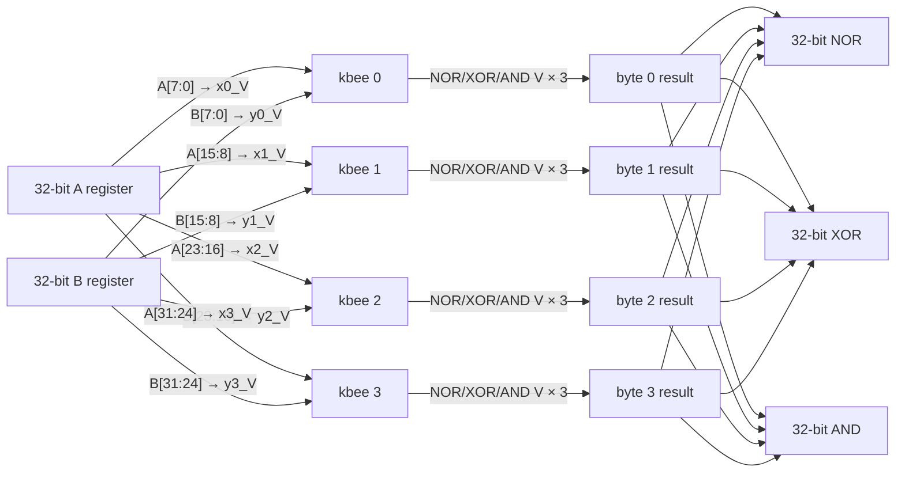

# kbee-07 — 32-bit RISC-V bitwise-ops sketch (paper only)

**Status:** sketch; **no silicon build** at this phase. Implemented after
kbee-04-full and kbee-06-nand pass.
**Target:** the 32-bit NOR/XOR/AND subset of RV32I bitwise instructions,
realised as four parallel kbee-04 instances, one per byte slice.
**Scope:** pin budget, clocking, slice layout; stop short of a full
integer-ALU design — kbee produces only bitwise logic.

*"plan §N" citations refer to the project's internal design plan, which is not included in this public repo.*

## 1. Why four kbee instances cover 32-bit bitwise ops exactly

Bitwise NOR/XOR/AND are **position-independent**: bit `i` of the output
depends only on bit `i` of the two inputs. There is no carry, no cross-bit
coupling — the 32-bit op is the concatenation of 32 independent 1-bit
ops. Group those 32 bits into four byte-slices of 8, and each slice maps
to exactly one kbee-04 op:

```
slice 0 (bits  0.. 7)  ── kbee 0 ──► NOR/XOR/AND byte 0
slice 1 (bits  8..15)  ── kbee 1 ──► NOR/XOR/AND byte 1
slice 2 (bits 16..23)  ── kbee 2 ──► NOR/XOR/AND byte 2
slice 3 (bits 24..31)  ── kbee 3 ──► NOR/XOR/AND byte 3
```

No inter-slice wiring. No timing fences between slices. Each kbee runs
its 8-tick operation independently; the four results are concatenated in
the ingress/egress plumbing.

## 2. Diagram (copied from plan §9, annotated)



## 3. Implementation options (ordered by ease)

### Option A — four AN231E04s on one dev board (preferred)

Four chips, each loaded with `fpaa/designs/kbee-04.ad2`. Clocks may be
independent: every op completes in 32 µs and no cross-slice timing
signal is needed. The composition is realised in the board's DAC/ADC
fabric, not in hardware wiring between chips.

**Pin budget per slice:** 2 analog inputs + 3 analog outputs = 5 analog
pads. × 4 slices = **20 analog pads** total across the four chips, plus
whatever MCU GPIOs drive tick strobes and read VALID edges (≈ 3 digital
pins per chip, 12 total).

**MCU responsibilities:**

- Slice ingress: read the two 32-bit operands from the RISC-V core,
  split into four bytes, drive each byte's `x_V = byte / 255 · V_range/2`
  onto its slice's input pad via the on-board DAC. (Note: the voltage
  mapping is linear in the 8-bit binary value because that's how kbee
  already encodes `0 / 1` digits as `0 / 3^k · V_unit`.)
- Slice egress: sample each chip's three output pads at `VALID`,
  quantise back to 8-bit via ADC, concatenate into three 32-bit
  results.
- Issue the `LOAD` / tick / `VALID` digital signals per chip.

**Timing budget:**

- Per 32-bit op: 32 µs chip time + ≈ 10 µs DAC settling + 5 µs ADC
  sample = roughly **50 µs per op**, = 20 kHz op rate. Useful for
  benchmarking but too slow for a real RISC-V ALU replacement; this
  is a scientific demonstration, not a performance target.

### Option B — one AN231E04, four sequential time-multiplexed ops

Single chip loaded with kbee-04. MCU drives it four times, once per
byte slice, streaming bytes through the same physical chip. Each 32-bit
op takes ~4 × 50 µs = 200 µs, = 5 kHz op rate. Uses only one chip
(and 5 analog + 3 digital pads) — the cheapest possible ternary-RISC-V
bench.

Good fit for the first-silicon demo: prove the 32-bit claim without
needing four chips in parallel.

### Option C — one chip, four kbee cores in parallel on-die

Would need 16 CABs (4 kbees × 4 CABs). AN231E04 has 4 CABs. **Not
feasible on this part.** Flag the next higher-density FPAA (Anadigm
Apex 2 with more CABs, or any future part with ≥ 16 CABs) as a
candidate for future work.

## 4. Per-slice I/O routing (Option A)

Assume the dev board gives us 16 addressable DAC channels and 16
addressable ADC channels (plausible for a Raspberry Pi Pico 2 with
four MCP4728 DACs + a single ADS1115 mux, or similar). Per slice:

| Signal | Direction | Resolution | Notes |
|----------------|-----------|--------------------------|-----------------------|
| `x_V[i]` | MCU→chip | ≥ 12 bits (DAC) | 4096 levels across 0..V_range/2 is enough to distinguish the 256 valid inputs with headroom |
| `y_V[i]` | MCU→chip | ≥ 12 bits (DAC) | same |
| `A_NOR_V[i]` | chip→MCU | ≥ 14 bits (ADC) | kbee-04 hardware aims for 1-LSB-on-V_range accuracy, so the ADC should exceed the chip's inherent precision |
| `A_XOR_V[i]` | chip→MCU | ≥ 14 bits (ADC) | same |
| `A_AND_V[i]` | chip→MCU | ≥ 14 bits (ADC) | same |
| `LOAD[i]` | MCU→chip | digital | shared wiring OK |
| `TICK[i][2:0]` | MCU→chip | digital (optional) | only if kbee-02 chose (c) dynamic reconfig |
| `VALID[i]` | chip→MCU | digital | IRQ line to MCU |

Routing principle: treat each chip as an independent peripheral. No
cross-chip analog wiring. Shared signal ground with single-point
connection at the board power-ground reference.

## 5. Validation plan (when kbee-07 is actually built)

1. Generate the 32-bit oracle analogous to `kbee-w8-refs.csv`: for all
   `(A, B)` 32-bit pairs (too many; sample instead: 100k random
   `(A, B)` + every `A == B` + every `A == ~B` + edge rows), compute
   `NOR/XOR/AND(A, B)` in Python as the ground truth.
1. For each test `(A, B)`:
   - Split into four bytes each way.
   - Drive each byte onto its slice's DAC and run one kbee-04 op.
   - Read back the three output bytes per slice from ADC, concatenate
     into three 32-bit results.
   - Compare to the Python oracle; log per-byte error rate.
1. Compute per-bit-position error rate over the 32 bits. Bits near
   byte boundaries (positions 0, 8, 16, 24 within each byte) should
   see identical error rates, since they all correspond to the same
   tick-7 LSB of their local kbee. Any asymmetry means a per-chip
   calibration problem.

## 6. Open questions for the real build

- **Calibration scope.** Do the four chips need one-time per-chip
  calibration (threshold tweaks, V_unit tweaks) or does a single
  golden configuration cover all four? Answer depends on AN231E04
  part-to-part variation — not known yet; measure at build time.
- **ADC-vs-kbee precision matching.** kbee-04 sits at `V_unit ≈ 0.15 mV`. A 14-bit ADC across 1 V is ~0.06 mV LSB, which is below
  the chip's precision — good. Confirm that the MCU-side DAC (driving
  the inputs) also lands below `V_unit`, else the *input* becomes the
  precision bottleneck.
- **Concurrency.** Option A runs four chips in parallel; does the
  dev-board's MCU have enough DMA channels / compute to drive four
  DACs + sample four ADCs without introducing bit-misordering? Design
  the ingress / egress to use DMA-backed batch transfers, not bit-by-
  bit MCU reads.

## 7. Not in scope here

- **Arithmetic ops.** kbee only does bitwise NOR/XOR/AND. ADD/SUB and
  the rest of RV32I are not in kbee-07. They'd require either a ternary
  adder (entirely different analogue block — see plan §0.2 discussions
  around `(x + y) mod 3^8`) or reversion to a digital ALU for those
  ops.
- **Carry-using bitwise ops.** There aren't any in RV32I; bitwise is
  pure bit-parallel. So this sketch is complete for the bitwise subset.
- **Cycle timing.** 50 µs/op is comfortably below any real RISC-V CPU's
  single-cycle budget. To use kbee as a real ALU replacement we'd have
  to drive ClockA up to the MHz range (which pushes past the chip's
  documented operating envelope). Out of scope: this is a proof of
  principle.

## 8. Handoff

Once kbee-06 passes on hardware and this sketch survives design review,
the first actual kbee-07 build is a dev-board with four AN231E04
sockets (Option A) driven by the existing dev-board MCU. No new
analogue design; all the analogue work is already in kbee-04. The
remaining engineering is firmware plumbing.
